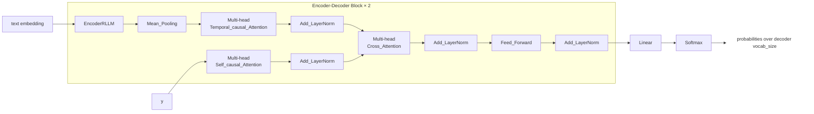

# Transformer Encoder–Decoder with Temporal and Cross Attention for Regression

This repository implements a custom **Transformer encoder–decoder architecture** designed for sequence-to-sequence modeling with **temporal attention**, **self-attention**, and **cross-attention**.  
The model is implemented in **PyTorch** and is suitable for temporal text-to-number generation

---

## Architecture Overview

At a high level, the model consists of:

1. **Text Encoder**
   - Encodes token-level text embeddings with padding-aware attention.
2. **Multi-head Temporal Attention Head**
   - Aggregates encoder outputs across time sequences.
3. **Decoder Stack**
   - Multi-head Causal self-attention over decoder inputs
   - Multi-head Cross-attention from decoder to encoded text representation
   - Position-wise feed-forward network
4. **Residual Connections + Layer Normalization**
   - Applied after every attention and feed-forward sub-layer

---

## Forward Pass Logic

1. Encode token embeddings (`text embedding`) using padding mask
2. Mean-pool encoder outputs to obtain a sequence-level representation
3. Apply **temporal attention** across sequences
4. Apply **causal self-attention** on decoder input `y`
5. Apply **cross-attention** from decoder to encoded text
6. Apply feed-forward transformation
7. Return updated embeddings and masks for downstream blocks

---

