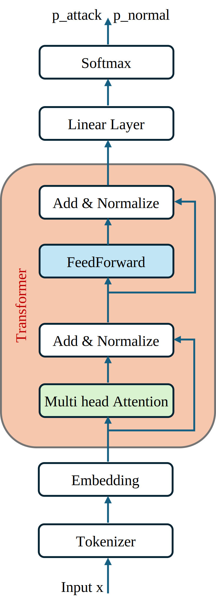

# Transformer Architecture For Classification of Network Attacks

## Overview

In this project we introduced a new approach for network attacks detection based on transformers architecture. To allow the model to learn from the entire collected data without performing any prior feature engineering, the input data (features) is concatenated and fed to the model as one sequence, allowing the model itself to determine the relevant features for the final decision.

* Create reduced size Transformer block.
* No pretrained model was used
* Features concatenated into 1 input sequence
* Multi Head Attention

## Model Architecture:

### Input
The input x is all the input features concatenated into one sequence separated by a special character [SEP].
Ex : « 11807528[SEP]5[SEP]0[SEP]30[SEP]0 »

### Tokenizer
We used Bert Tokenizer vocab_size of 30522

## Expirement
### 1. Data

We collected the data from a paper published by the University of New Brunswick-Canada. The dataset includes benign traffic alongside the most recent and commonly observed attacks, closely reflecting real-world network traffic captured in PCAP files. It also contains the results of network traffic analysis performed using CICFlowMeter, with flows labeled based on timestamps, source and destination IP addresses, source and destination ports, protocols, and attack type.

### 2. Hyperparameters

The goal was to keep the model size as small as possible, to reduce the training time and cost, while maintaining performance, the hyperparameters of the experiment are as follow:

	* embedding dimension d=192
	* Learning Rate= 1e-3
	* Max Sequence Length = 512
	* Batch Size = 128
	* dropout = 0.2
  
The model size is: 6.18 million parameters

### 3. Model training

The data was divided into 3 parts training data 80%, validation data 10%, test data 10%.
The model was trained in Kaggle and google Colab

## Results

We tested the model on 250 k samples, below the evaluation metrics:

* Recall: 99.84 %
* Precision: 99.47%
* True positive rate: 99.84%
* False positive rate: 0.21%

In the test data there is 42 588 attacks, the model was able to detect 99.90% of them, only 42 of them were not detected. On the other hand, among 214 069 normal activities 99.79% of them were properly classified as normal by the model, only 446 (0.21%) were misclassified as attacks.

